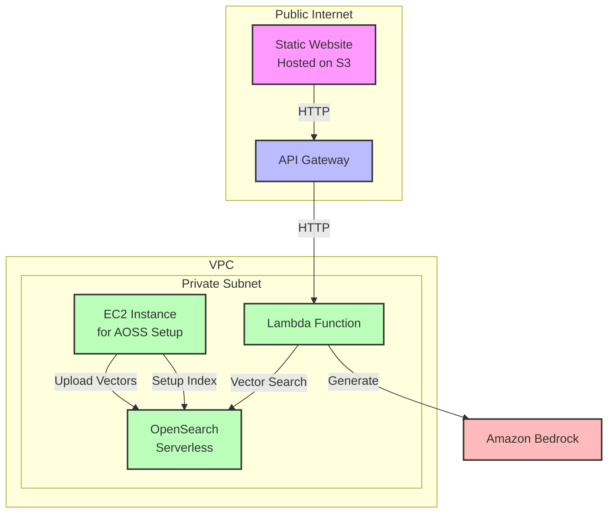

# AWS RAG TriviaQA Project

🚀 **Live Demo**: [Try the RAG TriviaQA Demo](https://aws-rag-triviaqa-site.s3.us-east-1.amazonaws.com/index.html)

This repository demonstrates a fully serverless Retrieval-Augmented Generation (RAG) architecture on AWS using the [TriviaQA dataset](https://www.kaggle.com/datasets/andreajaunarena/triviaqa-dataset).

Users can submit a question via a web-based UI backed by Amazon Bedrock and OpenSearch Serverless. The app can retrieve supporting Wikipedia evidence passages using vector search, and optionally pass them into a generative model to produce an answer.

## 🧠 How to Use
1. Open the [demo site](https://aws-rag-triviaqa-site.s3.us-east-1.amazonaws.com/index.html).
2. Enter a question in the text box (or choose from the 100 examples).
3. Choose a model from the dropdown.
4. Optionally enable "TriviaQA Wikipedia RAG".
5. Click **Ask** to receive an AI-generated answer.

## Demo Notes
1. Only the amazon.titan-text-lite-v1 model works at present.
2. The amazon.titan-text-lite-v1 model has very stringent guardrails and will reject some of the TriviaQA questions as inappropriate if RAG isn't enabled.
3. The amazon.titan-text-lite-v1 model may outright fail some TriviaQA requests without RAG enabled.

## Architecture



## 📁 Repository Structure

The repository showcases two complete implementations of TriviaQA-based RAG:

- A local FAISS-based RAG pipeline that can run on your laptop.
- A production-ready AWS Lambda-based RAG service using AWS OpenSearch Serverless (AOSS) running in a VPC.
  (the live demo is built on this code plus an API Gateway)

```
aws-rag-triviaqa-demo/
├─README.md
├─LICENSE
├─setup/
│   ├─install.sh
│   └─requirements.txt
├─common_utils/
│   ├─extract_to_s3.py
│   └─README.md
├─local-faiss-demo/
│   ├─build_faiss_index.py
│   ├─query_rag.py
│   └─README.md
├─aoss-serverless-demo/
│   ├─ec2_utils/
│   │   ├─create_aoss_index.py
│   │   ├─embed_to_aoss.py
│   │   ├─query_rag.py
│   │   └─README.md
│   ├─lambda/
│   │   ├─lambda_function.py
│   │   └─README.md
│   └─website/
│       ├─index.html
│       ├─config.json
│       └─README.md
```

---

## 🧰 Common Utilities

### `extract_to_s3.py`
Extracts relevant evidence files from the TriviaQA `.tar.gz` archive using the Wikipedia subset from `wikipedia-train.json` and uploads them to a specified S3 bucket.

---

## 💻 Local FAISS-based Demo

### `build_faiss_index.py`
- Downloads evidence files from S3
- Splits into chunks
- Generates Titan embeddings
- Stores vectors in a FAISS index and saves metadata

### `query_rag.py`
- Embeds a CLI prompt
- Retrieves top-k neighbors via FAISS
- Builds a RAG prompt and sends it to Bedrock
- Supports `--disable-rag` for baseline model-only responses

---

## ☁️ Serverless + AOSS Demo

### `ec2_utils/create_aoss_index.py`
Creates the AOSS index with FAISS k-NN vector settings.

**Usage:**
```bash
python create_aoss_index.py \
  --aoss-endpoint <AOSS_ENDPOINT> \
  --index <INDEX_NAME> \
  --region <AWS_REGION>
```

### `ec2_utils/embed_to_aoss.py`
- Iterates over S3 files
- Chunks and embeds each file
- Indexes chunks in AOSS

**Usage:**
```bash
python embed_to_aoss.py \
  --bucket triviaqa \
  --prefix evidence/wikipedia/ \
  --aoss-endpoint <AOSS_ENDPOINT> \
  --index triviaqa \
  --region us-east-1 \
  --model-id amazon.titan-embed-text-v1
```

### `ec2_utils/query_rag.py`
- Embeds a prompt
- Retrieves similar chunks from AOSS
- Generates a response with Titan or other Bedrock models

**Usage:**
```bash
python query_rag.py \
  --region us-east-1 \
  --index triviaqa \
  --aoss-endpoint <AOSS_ENDPOINT> \
  --embed-model-id amazon.titan-embed-text-v1 \
  --gen-model-id amazon.titan-text-lite-v1 \
  --top-k 5 \
  --enable-rag
```

### `lambda/lambda_function.py`
Deployed in VPC Lambda. Accepts HTTP GET with `prompt`, `model_id`, and `enable_rag` parameters and returns a grounded response.

**Environment Variables Required:**

These must be defined in the Lambda configuration:

- `AOSS_ENDPOINT` — the full OpenSearch Serverless endpoint URL (e.g. `https://xxxxx.us-east-1.aoss.amazonaws.com`)
- `INDEX_NAME` — the name of the AOSS index used for vector search
- `S3_SITE_ORIGIN` - the S3 site URL for the demo website to enforce CORS
---

## 🌐 Static Web UI Demo

### `website/index.html`
This is a simple single-page HTML interface you can host on S3. It:
- Accepts a question
- Sends a GET request to your API Gateway endpoint
- Displays the model-generated answer

To use:
1. Upload `index.html` to an S3 bucket with static site hosting enabled
2. Set the bucket policy to allow public reads (if needed)
3. Open your S3 static website URL to interact with your deployed RAG system

---

## 🔐 IAM + Networking Requirements

* VPC Endpoints:
  * `com.amazonaws.us-east-1.aoss`
  * `com.amazonaws.us-east-1.bedrock`
  * `com.amazonaws.us-east-1.sts`

* IAM roles must include:
  * `bedrock:InvokeModel`
  * `aoss:ReadDocument`, `aoss:WriteDocument`

---

## 🔧 Setup Scripts

```bash
cd setup
chmod +x install.sh
./install.sh
```

---

## 📄 License

MIT License. See [LICENSE](./LICENSE) for details.

---

## 🧠 Credits

© 2025 Robert E. Taylor, Extropic Systems

